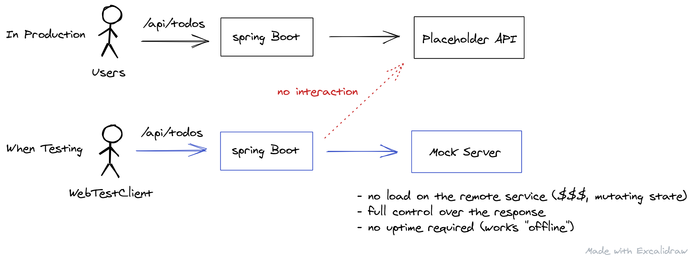

# Codebase for the blog post [Spring Boot Integration Tests with WireMock and JUnit 5](https://rieckpil.de/spring-boot-integration-tests-with-wiremock-and-junit-5/)

Steps to run this project:

1. Clone this Git repository
2. Navigate to the folder `spring-boot-integration-tests-wiremock`
3. Run `mvn verify` to execute the integration tests on your machine
4. (Optional) To start the application, execute `mvn spring-boot:run` and access http://localhost:8080/api/todos
